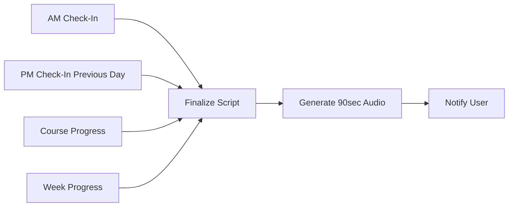

# OsMEN Obsidian Vault - Master Instructions

# meta #instructions #system

> **For Agents**: This file contains the canonical instructions for how to interact with this vault.
> **Last Updated**: 2025-12-11
> **Vault Purpose**: HB411 Healthy Boundaries for Leaders - Fall 2025

---

## 🔗 Unified Orchestration Integration

**This vault is managed by the OsMEN orchestration layer.**

### Source of Truth

All paths and configurations are defined in `integrations/orchestration.py`:

```python
from integrations.orchestration import OsMEN, Paths, Pipelines

# This vault's paths
Paths.HB411_OBSIDIAN      # This vault root
Paths.VAULT_TEMPLATES     # templates/
Paths.VAULT_GOALS         # goals/
Paths.VAULT_JOURNAL       # journal/
Paths.VAULT_INSTRUCTIONS  # This file

# Related pipelines
get_pipeline("am_checkin")      # AM check-in workflow
get_pipeline("pm_checkin")      # PM check-in workflow
get_pipeline("daily_briefing")  # 90-sec briefing generation
```

### Two-Way Bindings

This vault connects to OsMEN systems bidirectionally:

| Direction | Source | Target | Mechanism |
|-----------|--------|--------|-----------|
| Vault → OsMEN | Check-in files | Briefing generator | n8n webhook |
| OsMEN → Vault | Briefing scripts | daily_briefings/ | Python agent |
| Vault → ChromaDB | Reading notes | RAG embeddings | Sync script |
| ChromaDB → Vault | Query results | Smart Connections | API |
| Vault → Logs | All edits | logs/system_events/ | Agent logger |

### CLI Access

```bash
# From command line
python cli_bridge/osmen_cli.py checkin am        # Create AM check-in
python cli_bridge/osmen_cli.py checkin pm        # Create PM check-in
python cli_bridge/osmen_cli.py checkin status    # Show status
python cli_bridge/osmen_cli.py briefing generate # Generate briefing
python cli_bridge/osmen_cli.py progress hb411    # Show course progress
```

---

## 📊 Embedding Integration

### Dual Embedding Strategy

This vault uses **BOTH** embedding systems:

1. **ChromaDB (External)** - Primary RAG for agent queries
   - Collection: `course_hb411`
   - Path: `../embeddings/chroma_db/`
   - 4,751 documents indexed
   - Access via: Gateway API, CLI, Langflow, n8n

2. **Obsidian Smart Connections (Internal)** - In-vault semantic search
   - Plugin: `smart-connections`
   - Local embeddings for note-to-note linking
   - Real-time as notes are edited

### Linking Embeddings to Files

Each reading note should include a YAML frontmatter block:

```yaml
---
title: "Book Title"
author: "Author Name"
chroma_doc_ids: ["abc123", "def456"]  # ChromaDB document IDs
audiobook: "../audiobooks/Book_Title.m4b"
extraction_path: "../readings/raw/Book_Title/"
word_count: 12345
---
```

### Querying Embeddings

**From Obsidian** (via Dataview + Custom Script):

```js
// Use templater to query ChromaDB
<%* const results = await tp.user.chromaQuery("boundary ministry") %>
```

**From CLI**:

```bash
python -m integrations.librarian search "boundary ministry" --collection course_hb411
```

**From Agents**:

```python
from integrations.memory import HybridMemory
memory = HybridMemory.from_env()
results = memory.recall("boundary ministry", mode="lateral")
```

---

## 📋 Daily Check-In System

### Overview

Two mandatory check-ins per day:

- **AM Check-In** (6:30 AM trigger, complete by 9 AM)
- **PM Check-In** (8:00 PM trigger, complete by 10 PM)

### Check-In Components

1. **ADHD Executive Functioning**
   - Energy level (1-10)
   - Focus capacity estimate
   - Medication status (if applicable)
   - Known distractors today

2. **Productivity & Time Management**
   - Top 3 priorities
   - Time blocks planned
   - Blockers identified
   - Yesterday's completion rate

3. **Mood & Wellbeing**
   - Current mood (emoji + description)
   - Sleep quality (1-10)
   - Stress level (1-10)
   - Self-care planned

4. **Meditation Practice (Vajrayana)**
   - Trekchö practice status
   - Tummo practice status
   - Session duration
   - Practice notes

5. **Course Progress (HB411)**
   - Readings completed
   - Assignments due
   - Questions for class
   - Integration notes

### Check-In File Locations

```
journal/
├── daily/
│   ├── 2025-12-10-AM.md
│   ├── 2025-12-10-PM.md
│   └── ...
├── weekly/
│   └── 2025-W50-Review.md
└── monthly/
    └── 2025-12-Review.md
```

### Agent Verification Protocol

When ANY agent interacts with the user:

1. Check current time
2. Verify appropriate check-in exists for today
3. If missing, prompt user to complete it
4. Read check-in logs to understand user state
5. Update session log with interaction

---

## 🎙️ Daily 90-Second Audio Briefing

### Generation Workflow



### Script Template Variables

```yaml
# Populated from check-ins and system state
user_energy: 7
user_mood: "😊 focused"
top_priorities: ["Reading Response 3", "McBride Ch 5-6"]
course_week: 6
readings_behind: 0
readings_ahead: 1
adhd_focus_tip: "Use body doubling for reading session"
meditation_reminder: "Evening Tummo scheduled"
boundary_reflection: "Notice where you say yes when you mean no"
```

### Audio Generation

- Voice: `af_nicole` (calm, clear)
- Format: MP3 (smaller for daily files)
- Duration: 90 seconds (~225 words)
- Output: `daily_briefings/YYYY-MM-DD_briefing.mp3`

---

## 🎯 Personal Goals Section

### Live Trackers

These are "live" notes that multiple systems can read/write:

1. **Executive Functioning Dashboard** (`goals/adhd_dashboard.md`)
   - Weekly patterns
   - Medication effectiveness
   - Strategy effectiveness scores
   - Trigger identification

2. **Time Management Tracker** (`goals/time_tracker.md`)
   - Pomodoro counts
   - Deep work hours
   - Interruption log
   - Weekly time audit

3. **Meditation Log** (`goals/meditation_log.md`)
   - Trekchö sessions (rigpa recognition)
   - Tummo sessions (inner heat)
   - Retreat planning
   - Teacher guidance notes

4. **Course Progress** (`goals/hb411_progress.md`)
   - Reading completion %
   - Assignment status
   - Participation notes
   - Grade tracking

### Access from Other Systems

These files use a standard YAML frontmatter that other systems can parse:

```yaml
---
type: live_tracker
last_updated: 2025-12-10T08:30:00
sync_targets:
  - chromadb
  - gateway_api
  - n8n_webhook
---
```

---

## 📝 Logging Requirements

### All Actions Must Log

Every agent action creates a log entry:

```
logs/
├── agent_sessions/
│   └── YYYY-MM-DD_HH-MM_agent-name.json
├── check_ins/
│   └── YYYY-MM-DD_checkin.json
├── audio_generations/
│   └── YYYY-MM-DD_audio.json
└── system_events/
    └── YYYY-MM-DD_events.json
```

### Log Entry Format

```json
{
  "timestamp": "2025-12-10T08:30:00Z",
  "agent": "yolo-ops",
  "action": "generate_daily_briefing",
  "inputs": {
    "am_checkin": "2025-12-10-AM.md",
    "pm_checkin_prev": "2025-12-09-PM.md"
  },
  "outputs": {
    "script_file": "briefing_scripts/2025-12-10.txt",
    "audio_file": "daily_briefings/2025-12-10.mp3"
  },
  "status": "completed",
  "notes": "User energy level 7, focused on reading response"
}
```

### Continuity Between Sessions

When a new agent session begins:

1. Read `logs/agent_sessions/` for recent context
2. Read today's check-ins
3. Read `goals/*.md` for current state
4. Update session log with "session_start" entry
5. On session end, write "session_end" with summary

---

## 🔄 Workflow Integration

### n8n Workflows

| Workflow | Trigger | Purpose |
|----------|---------|---------|
| `daily_90sec_briefing.json` | AM check-in webhook | Generate daily audio |
| `hb411_weekly_podcast.json` | Sunday 6 PM | Generate weekly podcast |
| `checkin_reminder.json` | 6:30 AM, 8:00 PM | Prompt user for check-ins |
| `progress_sync.json` | Hourly | Sync live trackers |

### Langflow Flows

| Flow | Purpose |
|------|---------|
| `daily_brief_specialist.json` | Process check-ins, generate briefing |
| `hb411_podcast_specialist.json` | Generate podcast scripts from RAG |
| `adhd_coach_specialist.json` | ADHD strategy suggestions |

### CLI Commands

```bash
# Check-in commands
osmen checkin am        # Start AM check-in
osmen checkin pm        # Start PM check-in
osmen checkin status    # Show today's check-in status

# Briefing commands
osmen briefing generate # Generate today's 90-sec audio
osmen briefing play     # Play today's briefing

# Progress commands
osmen progress hb411    # Show course progress
osmen progress adhd     # Show ADHD dashboard
osmen progress meditation # Show practice log
```

---

## 📂 Vault Structure

```
obsidian/
├── .obsidian/
│   ├── VAULT_INSTRUCTIONS.md  # THIS FILE
│   ├── app.json
│   ├── core-plugins.json
│   └── plugins/
├── templates/
│   ├── AM Check-In Template.md
│   ├── PM Check-In Template.md
│   ├── Daily Briefing Script Template.md
│   ├── Weekly Podcast Script Template.md
│   ├── Reading Note Template.md
│   └── Journal Entry Template.md
├── journal/
│   ├── daily/           # AM/PM check-ins
│   ├── weekly/          # Weekly reviews
│   └── monthly/         # Monthly reviews
├── goals/
│   ├── adhd_dashboard.md
│   ├── time_tracker.md
│   ├── meditation_log.md
│   └── hb411_progress.md
├── weekly/              # Course weekly notes
├── readings/            # Reading notes for textbooks
├── assignments/         # Assignment tracking
├── logs/                # System logs
├── HB411 - Course Hub.md
└── HB411 - Weekly Notes Index.md
```

---

*This instruction file is the source of truth for vault operations.*
*Agents should read this file at session start.*
