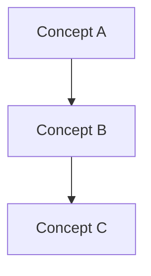

# {{course_code}} - Lecture {{lecture_number}}

**Date**: {{date}}
**Topic**: {{topic}}
**Chapter/Reading**: {{reading}}

## Pre-Lecture Preparation

- [ ] Read assigned chapter
- [ ] Review previous lecture notes
- [ ] Prepare questions

## Key Concepts

### 1. {{concept_1}}

> Definition or explanation

**Key Points:**
- 
- 
- 

**Examples:**
```
Example code or math here
```

### 2. {{concept_2}}

> Definition or explanation

**Key Points:**
- 
- 
- 

### 3. {{concept_3}}

> Definition or explanation

## Important Formulas/Equations

$$
formula_here
$$

## Diagrams



## Examples Covered in Class

### Example 1
**Problem:**

**Solution:**

### Example 2
**Problem:**

**Solution:**

## Questions Asked

1. **Q:** 
   **A:** 

2. **Q:** 
   **A:** 

## My Questions

- [ ] 
- [ ] 

## Connections to Other Topics

- Related to [[{{related_topic_1}}]]
- Builds on [[{{related_topic_2}}]]
- Used in [[{{related_topic_3}}]]

## Summary

> One paragraph summary of the lecture

## Action Items

- [ ] Review notes within 24 hours
- [ ] Complete practice problems
- [ ] Add to flashcards
- [ ] Discuss with study group

## Post-Lecture Review

**Confidence Level**: ⭐⭐⭐☆☆ (3/5)

**Topics to revisit:**
- 

**Questions for office hours:**
- 

---
*Lecture notes by {{author}} | Generated template by OsMEN*
